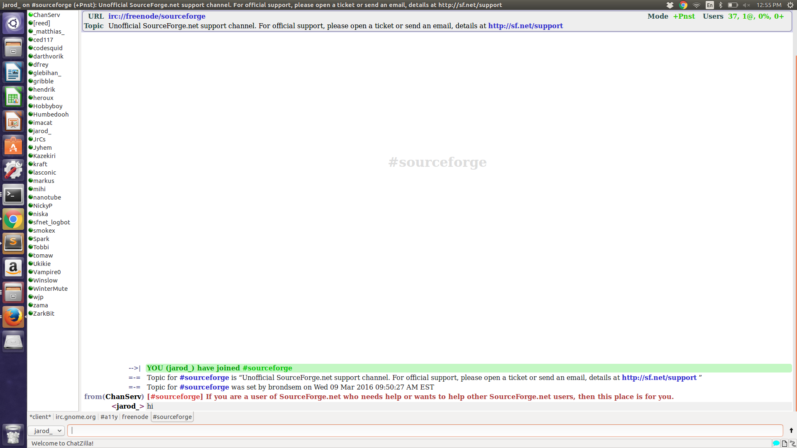
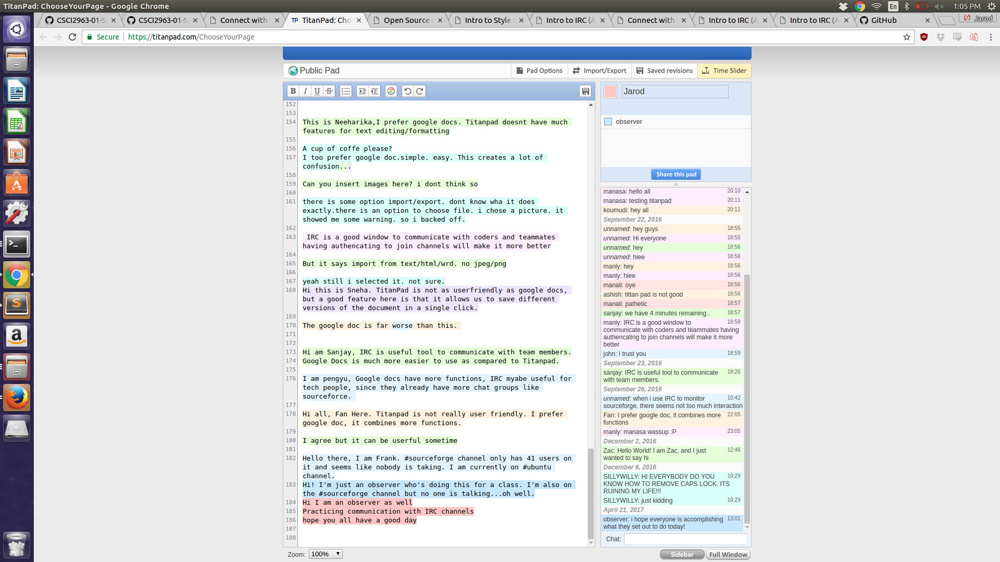

Q1:

Part 2:
I used chatzilla for my IRC program. I joined the server.irc.gnome and joined the #a11ly chat and it wasn't very active. 
People didn't seem willing to talk much with me, partially because I had nothing of substance to say. It was a little
weird trying to communicate since I felt like an outsider. The titan pad actually was much more active, I 
even saw people from our class in it.

Part3:

Q2:

Part 2:

Part 4:

Synchronous transmissions are synchronized by an external clock, while asynchronous
transmitions are one way only where a client doest wait or a message from the server it uses its own event to trigger sending the mesage.

In individual interaction it is less complicated but there still can be issues. The main key to success is having both people presenent and willing to communicate at the same time instead of intermitent and inefficient messages. In a group setting there has to be some sort of order where you reply to comments above you or you mention when you are changing the subject. Depending on how lare the group is you might need to directly give only certian people permissin to type at a specific time.

Collaborative software allows for much more efficient communication across the globe or after office hours. An issue of social concern could be completly remote companies that can outsource their work anywhere. Another issue could be having direct communication all the time being a burden on productivity or overworking employees.

In software you are missing out on the entire aspect of body language and subtle segways that normal conversation has. It is hard to know if 10 people in a group are about to talk or if no one is. 

Q3.
**Name: #csci2963-01spring2017
**Website: rcos.slack.com
**Description: A class channel were people can discuss and ask questions with the professor, or the professor can give general announcements and post helpful information.
**Project Goal: To learn about open source and to create your own project with the information learned.
**Communication Modes: The slack website. There are multiple channels for different subjects. The professor also has email capabilities if necessary.

Q4

Why coding style matters  Deliverable:

As we've learned most of development cost is spend in maintaining of code, and having a good 
coding style and having it agree with the group or company could make maintenece easier. At the start of you coding classes you can get really caught up in just geting your software to work and not worry about how mch of a mess your code is. In a way having a bad and non uniform style can lead to you getting messed up finding errors and debugging, and if you try and get a friend to help they could be helpless after seeing your code. I've also noticed my style is pretty different depending on the language. C++ and java look pretty similar, but the way I code my python is much more different.

Douglas Crockford Deliverable:
The perfection that a program has to have is both interesting and scary. In an essay you can make a misstake and it will still work alright but a program wont even compile if it isnt perfect. Even 
if it is "perfect" it can still fail later on in a beta test due to unknown bugs. In Javascript the style itself can prevent, like keeping the curly brace on the right can make it so you can 
avoid some silet errors. Certian conventions can be dangerous, like switch statements, breaks, with and more. Overall bad style can be the result of the undereducated, old schooler, and people who 
are "thrill" seekers who just want crazy code.

Part 3 link was broken