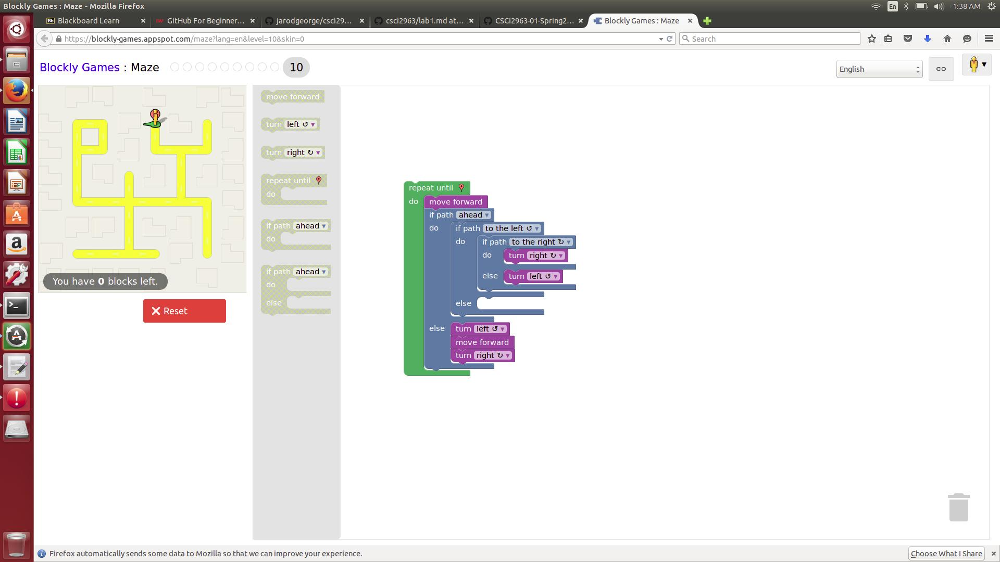
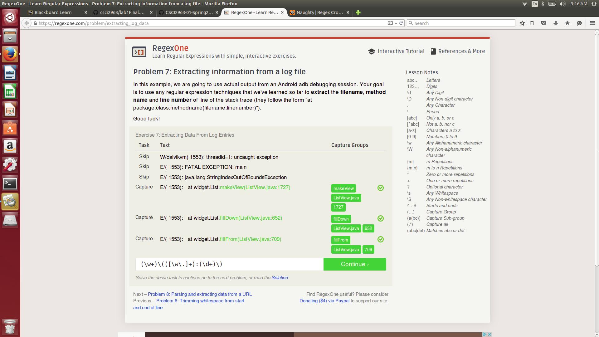
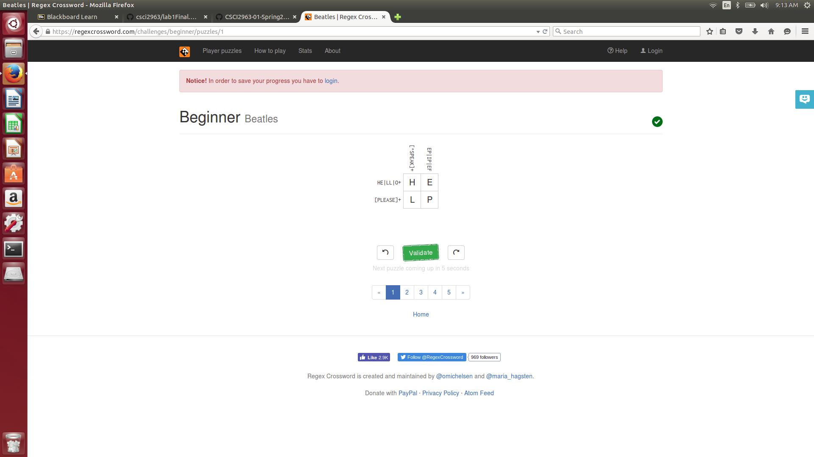
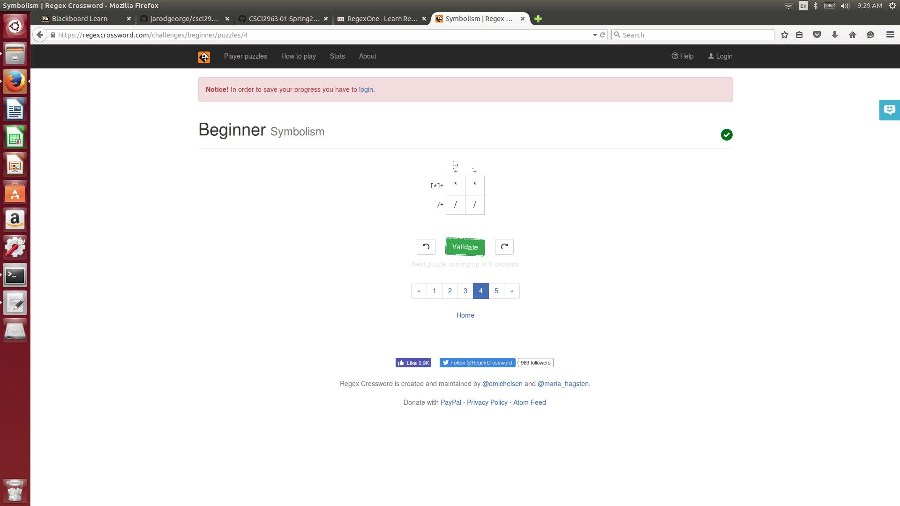

Lab1.md
2 suggestions for asking good questions.

1. Do not feel entitled to an answer. Many people are very skilled in their fields and their time is important, as the asker you should be thankful and grateful for any help, even if it does not completely solve your issue.

2. Do not become over reliant on asking questions. If you believe you can solve most problems yourself you will be more likely to work it out yourself in a potentially quicker fashion than if you asked a question and waited for a response. When working on a project you can feel helpless at times and rely too heavily on outside help when you yourself have many of the answers.

Chapter 3 reflections.

This chapter taught me how powerful technology and the Internet can be, and how much it can “damage” real life companies enough that they would sue. Often times it can feel like you are doing nothing wrong even though there is some “legal” law somewhere that would say otherwise. It's kind of like speeding on the highway, most people do it, but only some people get caught. Jesse was operating in a dangerous space at the wrong time when the RIAA was trying to come down hard on piracy and make an example of people. The RIAA also probably were behind the times of technology compared to the college students that were sued. I think you need to be aware of your surroundings and any legal issues that could come up when you are working on the Internet. Overall I think Jesse was wronged, and this can be seen by his reluctance to say he did anything wrong. It was impressive that these students managed to create a search engine on their own and it brings up the question who is responsible for illegal acts done on the internet  – the owner of the website/search engine, or the user? Both can point a finger at the other saying they didn't know this was possible/illegal but in the end people someone has to take a blame, but not fifteen million dollars worth of blame.

Reflection:

Me and Samad were thinking of a project that would use voice recognition to pick specific lines from famous quotes and maybe attach them together in some quote finidng program.

This activity has been really informative. I didn't know anything about regex or git comming into this class and it has been fun to learn a lot. I struggled a little bit with regex since I didn' learn it in focs before, but it seems to be a very powerful resource that should be learned. Same can be said for git, i'm getting the strokes down but I still have some issues with knowing exactly what commands to do to get my stuff on the repository every time.
